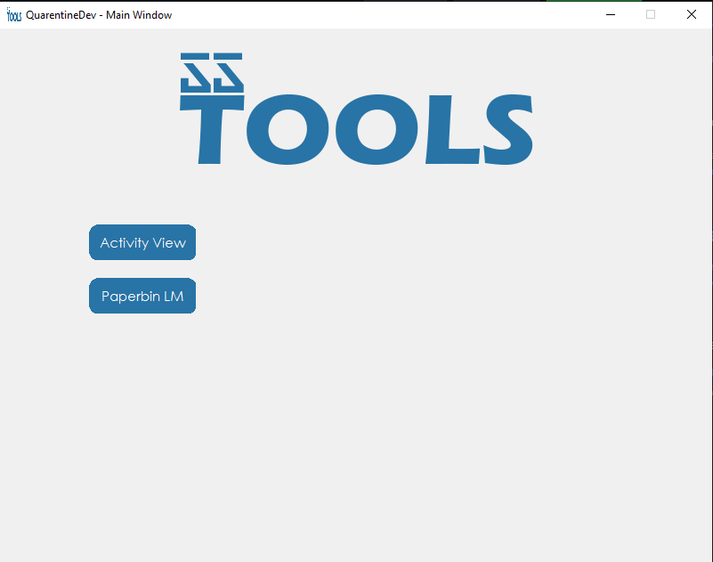

# MC SSTOOLS 

Mc sstools, es una herramienta multi-uso que facilita el trabajo en las revisiones a los usuarios la cual se sospeche el uso de ventajas ilegales!


## Instalacion de codigo abierto  y ejecucion

Utilice la herramienta [pip](https://pip.pypa.io/en/stable/) que le ofrece python para instalar diferentes librerias, la cual necesitara para crear una modificación propia del programa.

Puedes directamente descargar el codigo, o el ejecutable, que sea a tu comodidad, asegurate de descargar cada una de las librerias!

```
import tkinter
import tkinter_custom_button (clase externa)
import PIL
import OS
```
## ¿Como usarlo?

```python
Puede descargar el 'programa con el ejecutable EXE en la pagina oficial o del enlace dado por el creador.'.

Tambien puede crear su propio ejecutable con la librería #pyinstaller
únicamente si no tiene un sistema operativo de windows.

```
# Vista previa

